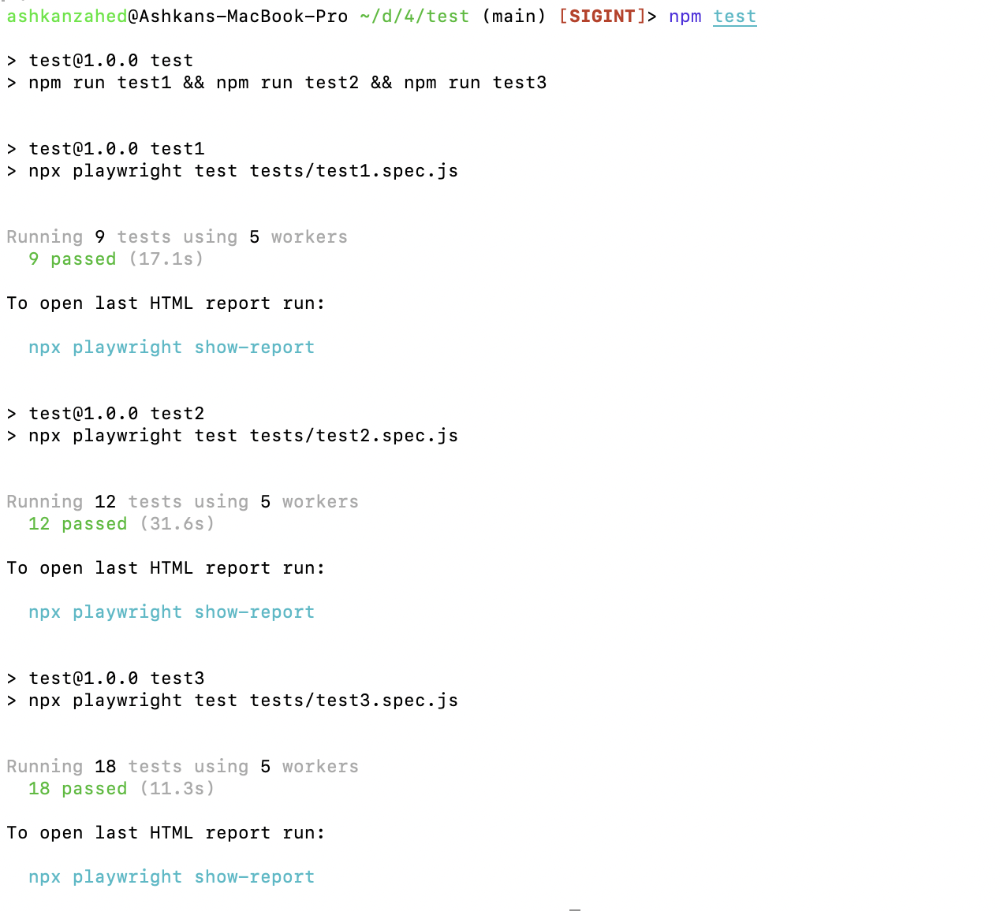
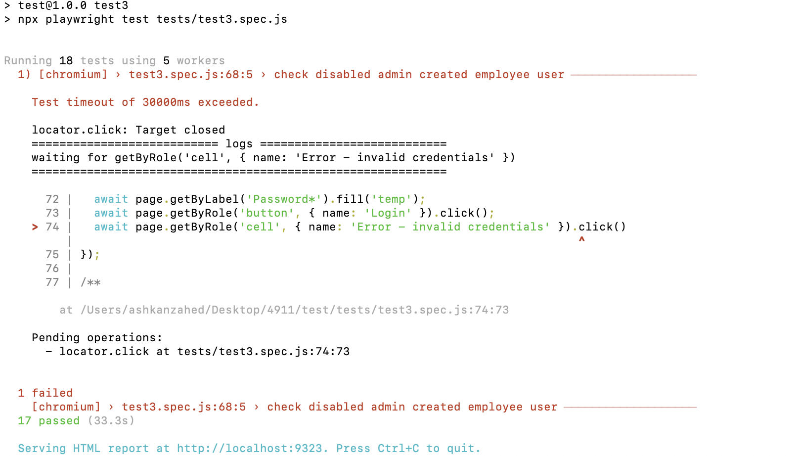
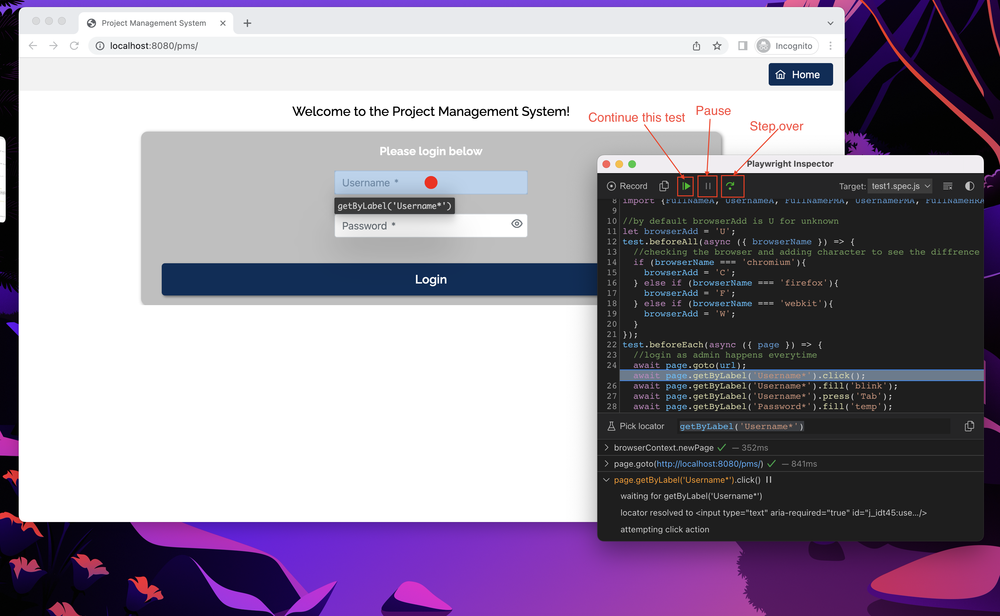

# Playwright Setup Guide for PMS Created by Ashkan Zahedanaraki with The BugBusters team - README

## Playwright is a Node.js library that allows you to automate browser actions such as launching browsers, navigating web pages, and interacting with the content. This README will guide you through the steps required to set up and use Playwright.

- We made these Playwright tests to have a quick way to test our use-cases in our PMS web app
- Playwright allowed us to test, build, and maintain our web applications.
- The use-cases that are run here will support Chrome, FireFox, and Webkit

## 📚 Table of Contents

- Prerequisites
- Installation
- How to run
- Notes
- Test fail
- Credits

## 📋 Prerequisites

Before installing Playwright, make sure you have the following software installed on your system:

- Node.js (version 12 or higher)
- npm (version 6 or higher, usually bundled with Node.js)

You can check the installed versions of Node.js and npm by running the following commands in your terminal or command prompt:

```
node -v
npm -v
```

## 🔧 Installation

Use the following commands to download our test and make your working directory inside the new directory:

```
git clone https://github.com/AshBeast/bugbustertesting.git
cd bugbustertesting
```

To install Playwright, open your terminal or command prompt and run the following command:

```
npm install playwright
```

This command installs Playwright and its browser dependencies (Chromium, Firefox, and WebKit).

Make sure Playwright has the correct URL by checking the file /tests/shared.js

```
export let url = 'URL';
```

This URL should lead to PMS. it does not matter if it is deployed or locally hosted,
if you can use this URL so can Playwright.

Please take note we are not responsible if these test break your web app.
Use caution when running this.

You need to have your database backed up before running this test.
You need to reset your database every time you run this test, you can use your backup or the mysql file provided.

## 🏃 How to run

To run all the tests, run this command:

```
npm test
```

Run the mysql file or use your backup to get rid of the "test users" these tests created and other garbage info.



You can run the test files individually by using npx, like this:

```
npx playwright test tests/test1.spec.js
```

We recommend that if you want to run the test file test2.spec.js you run test1.spec.js before that.
and if you want to run test3.spec.js you should run test1.spec.js and test2.spec.js first but you can just use npm test since it already does this.

## 📝 Notes

We have 3 test files that have multiple tests inside of them.
The test files run in an order.
The tests inside files do not run in order, they have multiple workers that run the tests in parallel.

test1.spec.js summary
The admin creates 3 different types of users and test if they can login.

test2.spec.js summary
The HR (that was created by admin) creates 3 different types of users and test if they can login.
The HR also deactivates all users created by admin.
So use-cases add, list, deactivate users with HR is tested here

test3.spec.js summary
Here we check to see if the deactivated users can login.
We also check the reset password use-case with the users created by HR

So use-case deactivate users is check with login fail and reset password use-case is also tested.

## 🚫 Test fail

Tests can fail. You need to indentify if this is a problem with the test or the web app. Here is some Playwright tools that can help you.



Debuging is very useful to finding issues. you can add `--debug` after the command to run individual tests like the following:

```
npx playwright test tests/test1.spec.js --debug
```

or you can change the file /package.json 's scripts from

```
    "test1": "npx playwright test tests/test1.spec.js",
    "test2": "npx playwright test tests/test2.spec.js",
    "test3": "npx playwright test tests/test3.spec.js",
```

to

```
    "test1": "npx playwright test tests/test1.spec.js --debug",
    "test2": "npx playwright test tests/test2.spec.js --debug",
    "test3": "npx playwright test tests/test3.spec.js --debug",
```

`--debug` was added to all the test files. you can choose which test files to debug or not debug when you use the command `npm test` by changing this script.



You could also remove the parallel testing by adding `--workers=1` at the end script like you did with `--debug`.

Does it fail and you can't see why?
Chances are nothing is wrong with the web app but Playwright might just be putting to much pressure on the browser. try the test a couple times if it fails everytime than try it yourself find the issue.

## 💳 Credits

I used documentation from the Playwright website to learn and trouble shoot. This can help you as well for these tests.

https://playwright.dev/docs/intro
